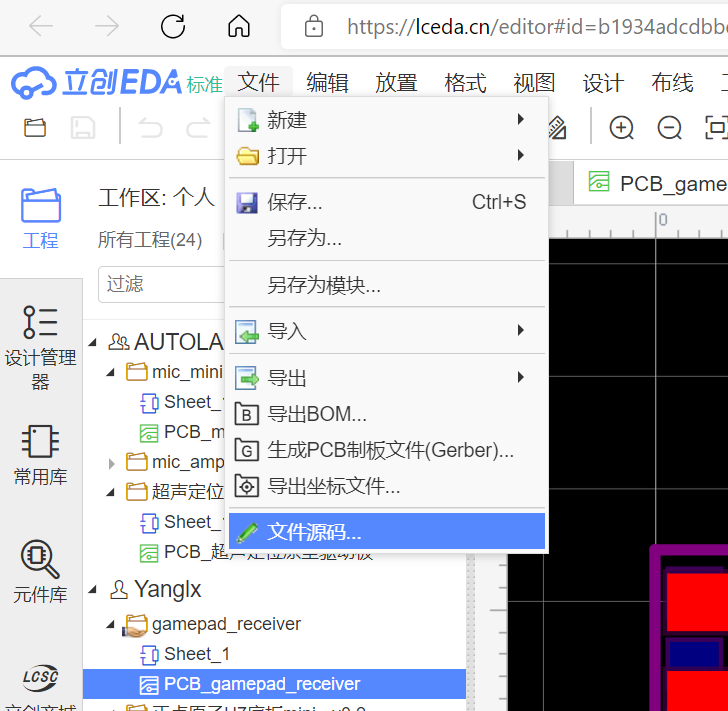
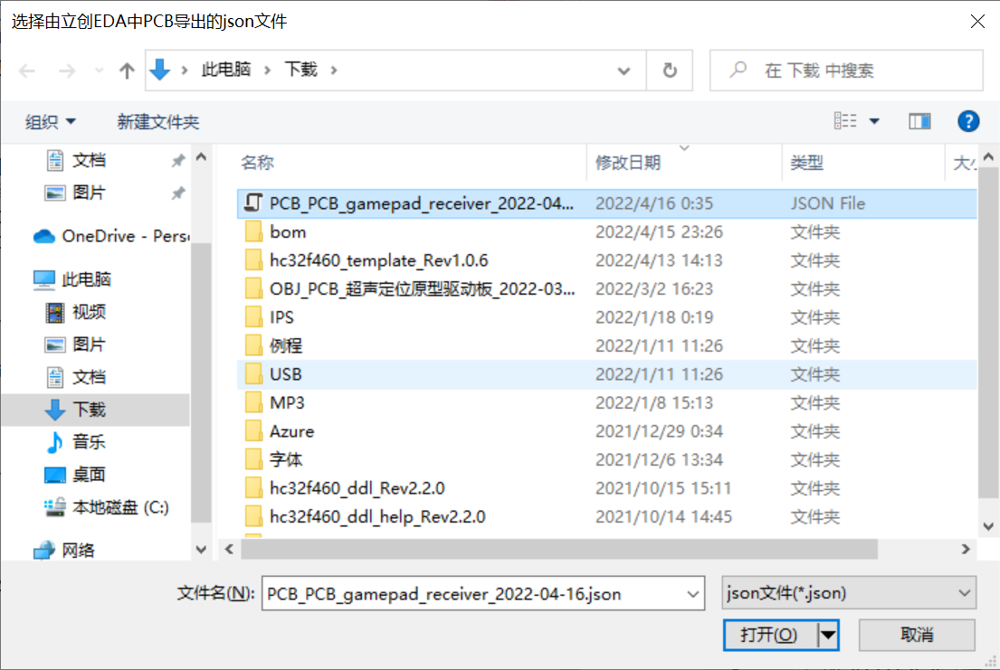
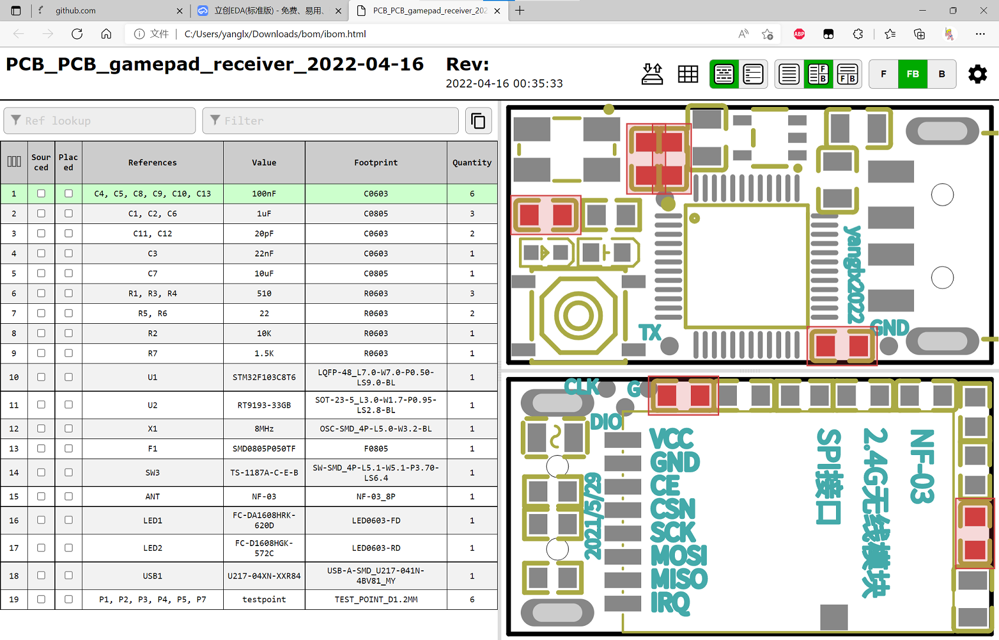

# InteractiveHtmlBom立创EDA快捷工具
运行程序弹出文件选择对话框，选择由立创EDA中PCB导出的json文件，自动调用InteractiveHtmlBom生成交互式bom在浏览器中打开

## InteractiveHtmlBom安装
* 下载[InteractiveHtmlBom.zip](https://github.com/openscopeproject/InteractiveHtmlBom/releases)并解压
* 安装[python](https://www.python.org/downloads/)（最新版本3.10安装wxpython时会报错，可安装3.9版本）
* 安装wxpython：执行命令 `py -m pip install wxpython` 即可（需要已安装VC环境）
* 将*HtmlBomTool.exe*放置在InteractiveHtmlBom路径下
* 双击*HtmlBomTool.exe*或者使用[TinyHotkeyTool工具](https://github.com/yanglx2022/TinyHotkeyTool)快捷键启动
  * TinyHotkeyTool示例配置（Ctrl+Alt+B启动）：`#CA|B|"C:\Program Files (Green)\Tools\InteractiveHtmlBom\HtmlBomTool.exe"#`

## 使用示例
* 立创EDA PCB界面菜单 -> 文件 -> 文件源码，弹出的对话框中点击下载按钮下载json文件
* 运行*HtmlBomTool.exe*弹出文件选择对话框选择下载的json文件打开
* 稍后bom自动在浏览器中打开（生成的html文件在json文件所在目录的bom文件夹下）

